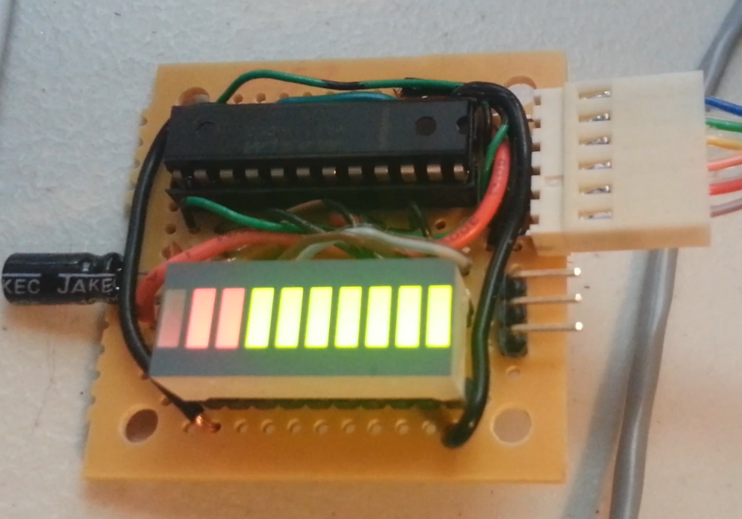

# TWPI Desk Server Info Display

# Requirements

- LCD display + led bar display…
  - Server Name
  - Player Count
  - TPS
  - More?
- Any server with the mod running should be shown on the Raspberry Pi display.

# Technologies

- Java
- Minecraft Forge
- .NET Core WEB API + SignalR Server (No longer using MQTT)
- Raspberry Pi SignalR Client in Python

# Implementation

The final product will be a display for our server status&#39;. Kind of like a desk clock, but with LED bar graphs and maybe an e-paper display for realtime player count, server status, tps, etc.

Some examples of what this might look like:

[Image Source](https://www.raspberrypi.org/blog/build-an-e-paper-to-do-list-with-raspberry-pi/)

[Image Source](https://www.instructables.com/Controlling-simple-LED-Bar-Graph-with-Arduino/)
